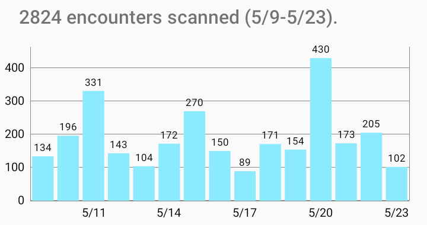
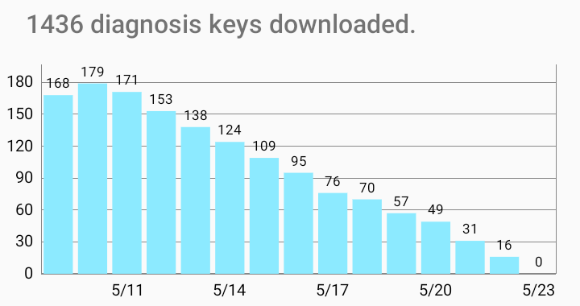
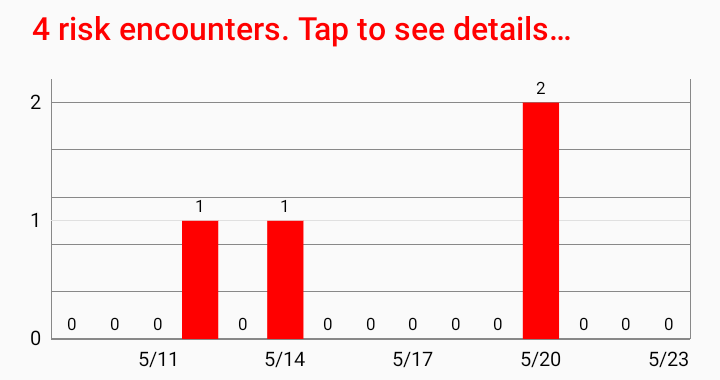
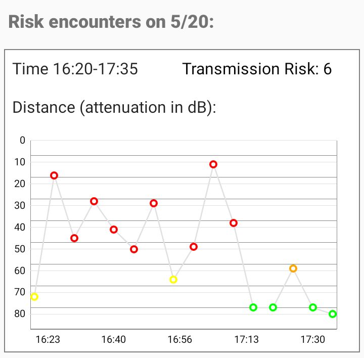

# corona-warn-companion-android
Android App Which Shows Details about CWA Exposures (Requires Root)

  

© 2020  Michael Huebler and other contributors.
This program is distributed in the hope that it will be useful, but WITHOUT ANY WARRANTY; without even the implied warranty of MERCHANTABILITY or FITNESS FOR A PARTICULAR PURPOSE.  See the GNU General Public License for more details.

# How to install the app
There are 3 options:
### 1. Get the app from the Play Store
1. Download from https://play.google.com/store/apps/details?id=org.tosl.warnappcompanion
2. Write a short review
### 2. Install a release from GitHub
1. Download the latest released APK from the Assets at https://github.com/mh-/corona-warn-companion-android/releases
2. Install via `adb` tool and USB cable: `adb install corona-warn-companion-github-release.apk`
### 3. Build the app from source code, using Android Studio
1. `git clone https://github.com/mh-/corona-warn-companion-android.git`
2. In Android Studio, select a 'flavor': 
`github` is the normal version, called "Corona-Warn-Companion". 
`playstore` is a version that was renamed to "Warn-App-Companion" because of the Play Store requirements for COVID-19 apps;
this is not a _category 1 or 2_ app and must therefore not use COVID-19 related terms in its Play Store listing.
3. Build the `debug` build variant, and install it on your device. 
The `release` build variant will probably build out-of-the box only on macOS because of the way how the keystore for app signing is accessed.

# Features
This app helps you to better understand warnings of the official Corona-Warn-App.

**ATTENTION:** FOR FULL FUNCTIONALITY, THE APP REQUIRES ROOT PERMISSIONS. Without root permissions, the app cannot access your risk encounters, and only three features are available: 1. Test how many diagnosis keys can be downloaded from the server; 2. Use RaMBLE data; 3. Demo Mode.

### What the app does:
1. The app reads the Rolling Proximity IDs recorded by your device from the Exposure Notifications database 
   (this is only possible with root permissions, which is why official Exposure Notifications apps, such as Corona-Warn-App,
   cannot display these details).  
   
   Alternatively, the app can also read a database exported from the [RaMBLE - Bluetooth LE Mapper app](https://play.google.com/store/apps/details?id=com.contextis.android.BLEScanner) (does not need root permissions).
2. The app downloads the Diagnosis Keys from the official German Corona-Warn-Server and other countries' servers, as selected by you.
   For Germany, it downloads the keys published daily for the last few days, and the keys published every hour for today. Therefore, different information than in the official app might be displayed.
   Only keys for the days found in step 1 are shown and counted.  
   
3. The app compares both in order to find matches (risk encounters).  
   

If risk encounters are found, it shows the details:
At which times and with which radio attenuation (roughly corresponds to the distance) did the encounters take place, and what level of transmission risk did the encounters have.
For encounters that were recorded by RaMBLE, it can also display the location.

Note that 1 means a low and 8 means a high transmission risk.

### What the app does not do:
- The app does not process any personal data.
- The app only accesses the internet for the purpose 2 (see above), i.e. it only downloads data from the official warning servers and does not send any data to other servers (unless you ask it to show the location of an encounter, in which case it will contact OpenStreetMap servers).
- The app does not show any advertising.

**Note:** This app has only been tested on a few devices so far, so it is possible that it will not work and/or show incorrect results.

# Open Source
The source code of the app is published at https://github.com/mh-/corona-warn-companion-android, so you can check the source code, build the app yourself, and you are also welcome to contribute to improvements.

# RaMBLE mode - works without root permissions
This mode requires the installation of the [RamBLE - Bluetooth LE Mapper app](https://play.google.com/store/apps/details?id=com.contextis.android.BLEScanner).

In RaMBLE mode, the app will not read the Exposure Notification database, but instead read the most recent RaMBLE database export stored in the `Download` folder.
Note that the Exposure Notifications database contains `calibrated_rssi` ([see here](https://developers.google.com/android/exposure-notifications/ble-attenuation-overview#calibration_per-device_tx_power_and_per-device_rssi_correction)).
RaMBLE however stores only `raw_rssi`, which means that the colors shown on the details screen are probably different from the case when the app reads the Exposure Notifications database.

# Countries covered
- Austria
- Belgium
- Canada
- Czechia
- Germany, Ireland, Italy
- Netherlands
- Poland
- Switzerland
- England and Wales

In the top right hand corner of the app is a menu button, 
please use this to select the countries from which you want to download Diagnosis Keys.

Please note that we mainly follow changes that happen in the German CWA setup; if you experience problems with another country, 
please let us know via a GitHub issue.

# Other
- The app is used for private purposes only, it is not used for any business purposes.
- The app is not a "hacking tool". It only reads data from the memory of your own device, which is stored there without additional encryption.
